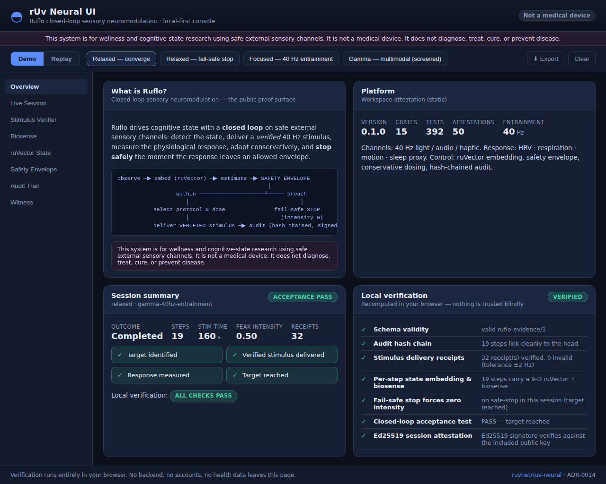
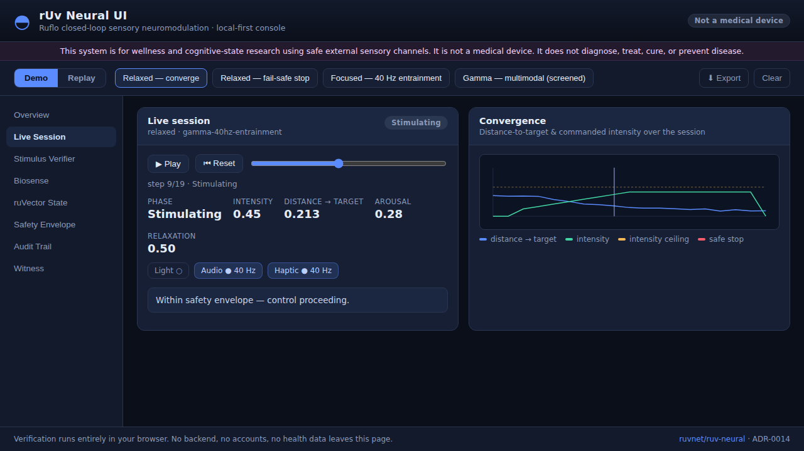
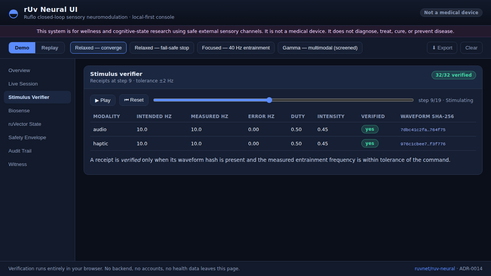
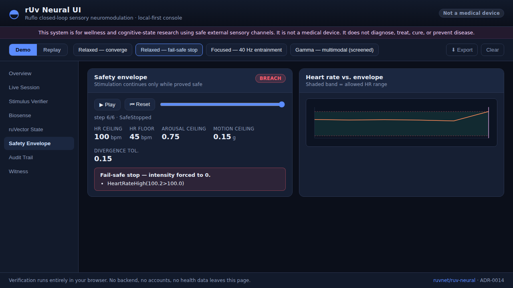
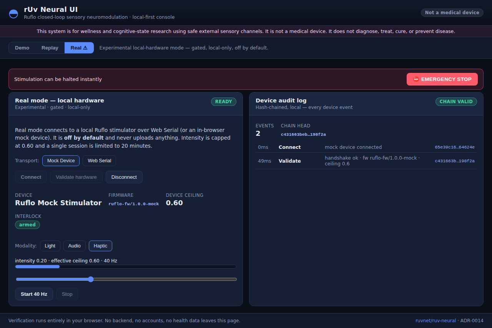
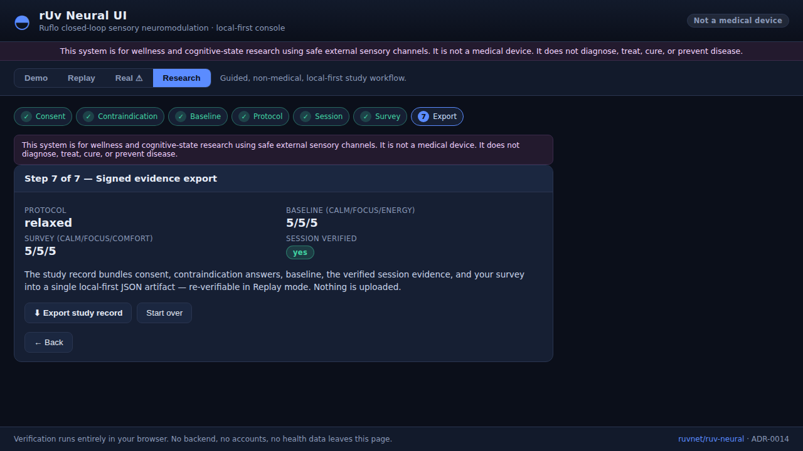

# rUv Neural — the open closed-loop OS for gamma-entrainment research

<sub>**Keywords:** 40 Hz gamma entrainment (GENUS) · multisensory stimulation ·
closed-loop neuromodulation · protocol optimization · sensory stimulation ·
neurofeedback · EEG signal processing · HRV · brain-network connectivity · graph
theory · minimum cut · NV-diamond magnetometry · OPM · quantum sensing ·
neurotechnology · reproducible research · Rust · ESP32 · WebAssembly</sub>

[](https://crates.io/crates/ruv-neural-core)
[]()
[]()
[]()
[]()

---

**rUv Neural is the open, closed-loop operating system for gamma-entrainment
research** — a research-grade harness to **measure, adapt, and compare** 40 Hz
sensory-stimulation protocols, with auditable, reproducible, cryptographically
signed evidence. Built in Rust; runs native, in the browser (WASM), and on the
edge (ESP32).

> **Not a medical device. Not a cure. Not a wellness toy.** rUv Neural makes **no
> efficacy claim.** It is *evidence infrastructure* for studying whether, when, and
> for whom sensory gamma stimulation does anything — and for running those
> protocols safely and reproducibly.

[](apps/ruv-neural-ui)

<sub>The in-browser console plays back **signed evidence bundles** and re-verifies
them entirely locally — no backend, no accounts, no data leaves the page.
[See the full UI ↓](#web-console--ruv-neural-ui)</sub>

## Contents

[Thesis](#the-thesis--the-wave-is-protocol-optimization) ·
[Five primitives](#five-primitives) · [Who it's for](#who-its-for) ·
[Why now](#why-now--the-research-wave) · [The wedge](#the-wedge--40-hz-protocol-workbench) ·
[Ethics](#ethics--responsible-use) · [Closed loop (Ruflo)](#closed-loop-sensory-neuromodulation-ruflo) ·
[Web console](#web-console--ruv-neural-ui) · [How it observes](#how-it-observes--brain-network-topology) ·
[Architecture](#architecture) · [Crate map](#crate-map) ·
[Hardware BOM](#hardware-parts-list) · [Witness verification](#cryptographic-witness-verification)

## The thesis — the wave is protocol *optimization*

The coming wave isn't another 40 Hz blinking light — it's **protocol
optimization**, and that is a *measurement, adaptation, and comparison* problem.
The questions researchers actually have to answer, and where rUv Neural sits on
each:

| Problem | rUv Neural position |
|---|---|
| Which modality works best? | light · sound · vibration · phase-locked multimodal |
| Who responds? | responder profiling (per-person state embedding) |
| When should stimulation happen? | sleep · rest · task · circadian window |
| How much is enough? | dose · duration · intensity |
| Is entrainment real? | EEG · HRV · motion · sleep · cognition |
| Is it safe? | photosensitivity · comfort · adherence · signed audit logs |

## Five primitives

1. **Stimulus engine** — 40 Hz light, audio, haptic; phase-locked multimodal output with verified delivery receipts. → [`ruv-neural-stim`](ruv-neural-stim)
2. **Closed-loop controller** — adapt intensity, duty cycle, modality, and timing from the measured response, inside a hard safety envelope. → [`ruv-neural-loop`](ruv-neural-loop)
3. **Response measurement** — EEG optional; also HRV, sleep, actigraphy, reaction time, adherence, subjective state. → [`ruv-neural-biosense`](ruv-neural-biosense) + the [topology pipeline](#how-it-observes--brain-network-topology)
4. **Protocol registry** — versioned protocols with receipts: frequency, waveform, lux, SPL, vibration amplitude, duration, time of day.
5. **Research evidence layer** — link protocols to papers, trials, results, safety notes, and reproducibility metadata — hash-chained and Ed25519-signed.

> **Companion tool — [`ruvn`](https://github.com/ruvnet/ruvn):** an AI research agent that turns a question into a **graded, cited evidence dossier** (searches → grades every source A/B/C/D → synthesizes from the best → fact-checks → cites). It's the practical front-end for the evidence layer above. Install `npm i -g @ruvnet/ruvn` ([npm](https://www.npmjs.com/package/@ruvnet/ruvn)), then run `ruvn`.

## Who it's for

| User | Value |
|---|---|
| **Labs** | reproducible stimulation protocols |
| **Startups** | faster device iteration |
| **Clinicians** | structured observational data |
| **Care homes** | safe, supervised pilots |
| **Researchers** | multimodal protocol comparison |
| **Developers** | Rust / WASM / edge SDK |

## Why now — the research wave

MIT and others report that multisensory 40 Hz stimulation may activate glymphatic
clearance pathways and affect amyloid and tau biology **in animal models**. Human
evidence is promising but still **mixed**, with large sham-controlled trials (such
as Cognito's pivotal study) ongoing.¹

That uncertainty **is the opportunity.** The field doesn't need another device
claiming fixed efficacy — it needs a system for **measuring, adapting, and
comparing** protocols. rUv Neural is that harness: the bridge between cheap sensory
hardware, serious neuroscience, and auditable adaptive protocols.

<sub>¹ Multisensory gamma stimulation & glymphatic clearance —
[Nature (2024)](https://www.nature.com/articles/s41586-024-07132-6). Human
efficacy remains under active, sham-controlled investigation; nothing here is a
clinical claim.</sub>

## The wedge — 40 Hz Protocol Workbench

The first demo turns a protocol into reproducible evidence:

- **Inputs** — frequency, modality, duration, intensity, time of day, safety limits
- **Outputs** — entrainment proxy, HRV shift, adherence, sleep impact, cognitive-microtask score, signed protocol receipt
- **Acceptance test** — run 7 days of mock or real sessions and generate a reproducible report: protocol version, delivered-waveform hash, safety events, adherence, and response trend

---

## Ethics & Responsible Use

> **This technology interfaces with human neural data. Use it responsibly.**
>
> - **Informed consent** is required before collecting neural data from any participant
> - **Never** deploy brain-computer interfaces without IRB/ethics board approval
> - **Data privacy**: Neural signals are among the most sensitive personal data categories. Encrypt at rest, anonymize before sharing, and comply with GDPR/HIPAA as applicable
> - **Clinical use** requires FDA/CE clearance and must be supervised by licensed medical professionals
> - **Do not** use this software for covert monitoring, interrogation, lie detection, or any application that violates human autonomy
> - **Dual-use awareness**: The same technology that helps paralyzed patients communicate can be misused for surveillance. Design with safeguards
> - This software is provided for **research and educational purposes**. The authors accept no liability for misuse
>
> See [IEEE Neuroethics Framework](https://standards.ieee.org/industry-connections/ec/neuroethics/) and the [Morningside Group Neurorights](https://nri.ntc.columbia.edu/content/neurorights) initiative for guidance.

---

## How it observes — brain-network topology

"Is entrainment real?" needs a response signal. rUv Neural's measurement core is a
modular Rust pipeline that turns multi-channel neural data — EEG, or magnetic fields
from quantum sensors (NV-diamond, OPM) — into a **dynamic connectivity graph**, then
applies **minimum-cut** algorithms to surface topology events: when brain networks
form, dissolve, merge, or split. That topology stream is the entrainment /
cognitive-response proxy the closed loop adapts to.

**This is not mind-reading.** It does not touch words, memories, or private
thoughts — it measures *how* cognition organizes itself (its live network
*topology*), not *what* you are thinking. Think Google Maps for cognition.

> **Honest scope.** Validated today on **EEG** and a **deterministic simulator** —
> not yet clinically validated on a population. The quantum-sensor front-end
> (NV-diamond / OPM) is the **research frontier**: magnetometry-grade hardware is a
> five-figure instrument (see [the BOM reality check](#core-nv-diamond-magnetometer-single-odmr-channel)),
> so EEG and the simulator are the practical paths to build against.

## Closed-Loop Sensory Neuromodulation (Ruflo)

> **Research-grade wellness & cognitive-state platform — not a medical device.**
> Only safe external sensory channels are used. Transcranial/implanted
> neuromodulation (TMS, tDCS/tACS, focused ultrasound, DBS, VNS) is **out of
> scope** — that is medical-device territory requiring clinical validation,
> dosing controls, contraindication screening, and regulatory review.
> See [ADR-0001](docs/adr/0001-scope.md).

Beyond *observing* topology, rUv Neural can *gently steer* cognitive state with a
**closed loop**: detect the state, deliver a verified sensory stimulus, measure
the physiological response, adapt conservatively, and **stop safely** the moment
the response leaves an allowed envelope.

| Channel | Role | Crate |
|---------|------|-------|
| 40 Hz light / audio / haptic | sensory entrainment (GENUS) | [`ruv-neural-stim`](ruv-neural-stim) |
| HRV · breathing · motion · sleep | response sensing | [`ruv-neural-biosense`](ruv-neural-biosense) |
| personal state embedding (ruVector) | per-person state fusion | [`ruv-neural-loop`](ruv-neural-loop) |
| protocol selection · guardrails · audit trail (Ruflo) | closed-loop control | [`ruv-neural-loop`](ruv-neural-loop) |

```text
  observe ─▶ embed (ruVector) ─▶ estimate state ─▶ SAFETY ENVELOPE
                                                       │
                            within ──────────────────┴────── breach
                               │                                 │
                     select protocol & dose               fail-safe STOP
                               │                            (intensity 0)
                     deliver VERIFIED stimulus ──▶ audit (hash-chained, signed)
```

**Acceptance test** ([ADR-0011](docs/adr/0011-acceptance-test.md)): the system can
*identify a target state, deliver a **verified** stimulus, measure a response, and
stop safely when the response moves outside the allowed envelope* — encoded as
`SessionReport::passes_acceptance()` and asserted in
[`ruv-neural-loop/tests/closed_loop_acceptance.rs`](ruv-neural-loop/tests/closed_loop_acceptance.rs).

```bash
# Drive a closed-loop session toward a relaxed state, then write signed evidence
cargo run -p ruv-neural-cli -- neuromod --target relaxed --seed 11 \
    --output report.json --audit audit.json --sign

# Demonstrate the fail-safe stop: inject an arousal spike mid-session
cargo run -p ruv-neural-cli -- neuromod --target relaxed --perturb 5

# Export a portable evidence bundle and verify it with the reference verifier
# (the same checks the web console runs in-browser — verdict matches byte-for-byte)
cargo run -p ruv-neural-cli -- neuromod --target relaxed --bundle bundle.json --sign
cargo run -p ruv-neural-cli -- verify-bundle -i bundle.json   # → VERDICT: PASS
```

```rust
use ruv_neural_loop::*;
use ruv_neural_stim::StimulusGenerator;

let mut controller = ClosedLoopController::new(
    ControllerConfig::default(),
    TargetState::relaxed(),
    StimulusGenerator::conservative(),       // sensory-safety limits enforced
    SafetyEnvelope::default(),                // fail-safe stop bounds
    Box::new(GammaEntrainmentProtocol::audio_haptic()),
);
let mut sim = LoopSimulation::responsive(11, 10.0); // closed-loop subject model
sim.run(&mut controller, 64);

let report = controller.report();
assert!(report.passes_acceptance());          // verified delivery + safe outcome
assert!(controller.sign_session().verify());   // Ed25519-attested audit head
```

Design decisions are documented as Architecture Decision Records in
[`docs/adr/`](docs/adr/0000-template.md); the drive-to-validated iteration log is
in [`docs/closed-loop-loop-log.md`](docs/closed-loop-loop-log.md).

### Web console — rUv Neural UI

A **static, local-first** web console ([`apps/ruv-neural-ui`](apps/ruv-neural-ui),
[ADR-0014](docs/adr/0014-web-console.md)) makes Ruflo understandable in five
minutes and **verifies the evidence entirely in your browser** — no backend, no
accounts, no health data leaves the page. It plays back real, signed evidence
bundles (`ruv-neural neuromod --bundle … --sign`) in **Demo** mode and verifies
any imported bundle in **Replay** mode: schema validity, a **recomputed** hash
chain, receipt integrity + frequency tolerance, fail-safe-stop semantics, the
Ed25519 signature, and the acceptance result. The Rust exporter and the
TypeScript verifier hash from the *same* fixed-precision canonical string, so the
chain is reproduced, not trusted.

| Overview — session summary + local verification | Live session — convergence |
|---|---|
|  |  |

| Stimulus verifier — verified 40 Hz receipts | Safety envelope — fail-safe stop |
|---|---|
|  |  |

A **gated Real mode** (Phase 4) adds explicit opt-in/consent + contraindication
screening, a Web Serial bridge (with an in-browser mock device so the flow is
demonstrable without hardware), a hardware-validation handshake, an
always-visible emergency stop, an enforced intensity ceiling, and a
hash-chained device-event log — all local-only, off by default. A guided
**Research workflow** (Phase 5) walks consent → contraindication → baseline →
protocol → verified session → survey → **signed evidence export**, re-verifiable
in Replay mode, with nothing uploaded.

| Real mode — gated local hardware | Research workflow — signed study export |
|---|---|
|  |  |

```bash
cd apps/ruv-neural-ui
npm install
npm run test      # vitest — schema + verifier + tamper-detection (Rust↔TS hash parity)
npm run dev       # local dev server
npm run build     # static build → dist/ (deploys to GitHub Pages)
```

## Hardware Parts List

Below is a reference bill of materials for building a basic multi-channel neural sensing rig.
Prices are approximate (2026). Links are for reference only — equivalent components from any
vendor will work.

### Core: NV Diamond Magnetometer (single ODMR channel)

ODMR works by pumping a nitrogen-vacancy diamond with green (532 nm) light,
sweeping a ~2.87 GHz microwave field across the NV spin resonance, and reading
the red fluorescence dip on a photodiode. Verified, currently-purchasable parts
(confirm price/stock at checkout — some are quote/lead-time items):

| Component | Qty | Approx Price | Vendor / Link | Notes |
|-----------|-----|-------------|------|-------|
| **NV-doped CVD diamond** (research grade) | 1 | ~$1,440 | [Element Six DNV-B1, 3.0×3.0×0.5 mm](https://e6cvd.com/us/application/all/dnv-b1-3-0mmx3-0mm-0-5mm.html) | The real sensing element: ~800 ppb engineered N, NV ensemble for magnetometry. Quote/lead-time item — **not** a $45 commodity. |
| **NV diamond** (budget / demo grade) | 1 | ~$200–500 (quote) | [Adámas Nanotechnologies NV diamond plates](https://www.adamasnano.com/diamond-plates) | HPHT plates (100–300 ppm N) for education/R&D. Brighter but worse spin coherence (T2) → lower sensitivity. Enough to *see* an ODMR dip. |
| **532 nm pump laser** (lab grade) | 1 | ~$1,000–2,000 | [Thorlabs 532 nm DPSS lasers](https://www.thorlabs.com/532-nm-diode-pumped-solid-state-dpss-lasers) | Real ODMR wants 50–150 mW CW. (Thorlabs' compact [CPS532](https://www.thorlabs.com/thorproduct.cfm?partnumber=CPS532) is only 4.5 mW — too weak.) |
| **532 nm pump laser** (budget) | 1 | ~$30–80 | [Laserlands 532 nm DPSS module](https://www.laserlands.net/diode-laser-module/532nm-dpss-green-laser-module.html) | A 50–100 mW DPSS "pointer" module works for a demo; poor power stability. **Class 3B — eye hazard, wear goggles.** |
| **2.87 GHz microwave source** | 1 | ~$20–35 | [ADF4351 PLL board, 35 MHz–4.4 GHz](https://www.amazon.com/Frequency-Synthesizer-Development-Generator-35M-4-4GHz/dp/B0BCWVHFT1) | Honest cheap real part — covers 2.87 GHz, SPI-controlled, SMA output. |
| **RF amplifier** (usually needed) | 1 | ~$93 | [Mini-Circuits ZX60-V63+ (50 MHz–6 GHz)](https://www.minicircuits.com/WebStore/dashboard.html?model=ZX60-V63%2B) | ADF4351 outputs only ~0 to +5 dBm; a ~20 dB gain block drives the NV spins through the loop. |
| **Microwave delivery loop** | 1 | ~$5–15 | hand-wound copper loop + [SMA pigtail (Digikey)](https://www.digikey.com) | ~1–2 mm copper loop against the diamond, fed by SMA. DIY. |
| **Long-pass optical filter** (essential) | 1 | ~$120 | [Thorlabs FEL0600, Ø1″ 600 nm long-pass](https://www.thorlabs.com/thorproduct.cfm?partnumber=FEL0600) | Blocks the 532 nm pump, passes NV red fluorescence (637–700 nm). Without it the pump swamps the detector — no ODMR contrast. |
| **Focusing / collection lens** | 1 | ~$30 | [Thorlabs ACL2520U aspheric, f=20 mm, NA 0.60](https://www.thorlabs.com/thorproduct.cfm?partnumber=ACL2520U) | High-NA lens to focus the pump and collect fluorescence. |
| **Photodiode + transimpedance amp** | 1 | ~$400 | [Thorlabs PDA36A2 switchable-gain Si detector](https://www.thorlabs.com/thorproduct.cfm?partnumber=PDA36A2) | Si photodiode + built-in switchable-gain TIA in one unit. DIY op-amp TIA (OPA381/OPA657) + bare Si photodiode is the ~$20–40 budget alternative. |

> **Reality check — NV-diamond magnetometry is research-grade hardware, not a
> $45 hobby part.** The microwave source is genuinely cheap (ADF4351, ~$20–35),
> but **the diamond and the optics dominate the cost.** A magnetometry-grade
> CVD diamond (Element Six DNV-B1) is ~$1,440, not $45; even an education-grade
> HPHT plate runs into the hundreds and trades away the spin coherence that
> gives you sensitivity. Add the essential long-pass filter (~$120), a high-NA
> lens, an amplified photodiode/TIA (~$400), and a pump laser strong enough to
> actually excite the NVs (50–100 mW — a real lab DPSS head is ~$1–2k). Honest
> figure: **the cheapest credible single-channel ODMR demo rig is several
> hundred dollars at the very low end (demo diamond, pointer laser, DIY
> electronics) and realistically ~$3,000–5,000 for a research-quality channel.**
> A 16-channel NV array is a serious scientific instrument — multiplied
> diamonds, lasers, optics and detection electronics, comfortably a five-figure
> build. **If you just want to develop the software, use the EEG path below or
> the built-in simulator** — they exercise the same pipeline without the
> quantum-optics bench.

### Alternative: OPM (Optically Pumped Magnetometer)

| Component | Qty | Approx Price | Link | Notes |
|-----------|-----|-------------|------|-------|
| Rb Vapor Cell (25mm, AR coated) | 8 | $35 ea | [AliExpress: Rubidium Vapor Cell](https://www.aliexpress.com/w/wholesale-rubidium-vapor-cell.html) | SERF-mode magnetometry |
| 795nm VCSEL Laser | 8 | $8 ea | [AliExpress: 795nm VCSEL](https://www.aliexpress.com/w/wholesale-795nm-vcsel-laser.html) | D1 line pump for Rb |
| Balanced Photodetector | 8 | $15 ea | [AliExpress: Balanced Photodetector](https://www.aliexpress.com/w/wholesale-balanced-photodetector.html) | Differential detection |
| Magnetic Shielding Mu-Metal Cylinder | 1 | $120 | [AliExpress: Mu-Metal Shield](https://www.aliexpress.com/w/wholesale-mu-metal-magnetic-shield.html) | 3-layer, >60dB attenuation |

### Alternative: EEG (Electroencephalography)

| Component | Qty | Approx Price | Link | Notes |
|-----------|-----|-------------|------|-------|
| Ag/AgCl EEG Electrodes (10-20 system) | 21 | $2 ea | [AliExpress: EEG Electrode AgCl](https://www.aliexpress.com/w/wholesale-eeg-electrode-ag-agcl.html) | Reusable cup electrodes |
| EEG Cap (10-20 placement, size M) | 1 | $45 | [AliExpress: EEG Cap 10-20](https://www.aliexpress.com/w/wholesale-eeg-cap-10-20.html) | Pre-wired 21-channel |
| Conductive EEG Gel (250ml) | 1 | $8 | [AliExpress: EEG Gel](https://www.aliexpress.com/w/wholesale-eeg-conductive-gel.html) | Low impedance contact |
| ADS1299 EEG AFE Board (8-ch) | 3 | $35 ea | [AliExpress: ADS1299 Board](https://www.aliexpress.com/w/wholesale-ads1299-eeg-board.html) | 24-bit, 250 SPS, TI analog front-end |

### Data Acquisition & Processing

| Component | Qty | Approx Price | Link | Notes |
|-----------|-----|-------------|------|-------|
| ESP32-S3 DevKit (16MB Flash, 8MB PSRAM) | 4 | $8 ea | [AliExpress: ESP32-S3 DevKit](https://www.aliexpress.com/w/wholesale-esp32-s3-devkit.html) | ADC readout + TDM sync |
| ADS1256 24-bit ADC Module | 2 | $12 ea | [AliExpress: ADS1256 Module](https://www.aliexpress.com/w/wholesale-ads1256-module.html) | High-resolution for NV/OPM |
| USB-C Hub (4 port, USB 3.0) | 1 | $10 | [AliExpress: USB-C Hub](https://www.aliexpress.com/w/wholesale-usb-c-hub-4-port.html) | Connect ESP32 nodes to host |
| Shielded USB Cable (30cm, ferrite) | 4 | $3 ea | [AliExpress: Shielded USB Cable](https://www.aliexpress.com/w/wholesale-shielded-usb-cable-ferrite.html) | Reduce EMI |
| Host PC or Raspberry Pi 5 (8GB) | 1 | $80 | [AliExpress: Raspberry Pi 5](https://www.aliexpress.com/w/wholesale-raspberry-pi-5-8gb.html) | Runs the rUv Neural pipeline |

### Assembly Tools

| Component | Qty | Approx Price | Link | Notes |
|-----------|-----|-------------|------|-------|
| Soldering Station (adjustable temp) | 1 | $25 | [AliExpress: Soldering Station](https://www.aliexpress.com/w/wholesale-soldering-station-adjustable.html) | For sensor board assembly |
| Breadboard + Jumper Wire Kit | 1 | $8 | [AliExpress: Breadboard Kit](https://www.aliexpress.com/w/wholesale-breadboard-jumper-wire-kit.html) | Prototyping |
| 3D Printed Sensor Mount (STL provided) | 1 | — | Print locally | Holds diamond chips in array |

**Estimated total cost (honest):** a single-channel NV ODMR rig is ~$700–1,000
(demo-grade diamond + budget laser + DIY electronics) to ~$3,000–5,000
(research grade); a 16-channel NV array is a five-figure scientific instrument
(see the NV reality check above). OPM is similarly lab-grade. **EEG is the
practical path at ~$200**, and the built-in **simulator costs nothing** — both
exercise the full pipeline.

### Assembly Instructions

1. **Sensor Array**
   - Mount NV diamond chips (or OPM vapor cells, or EEG electrodes) in the 3D-printed helmet/mount
   - For NV: align 532nm laser to each chip, position photodiodes for fluorescence collection
   - For OPM: install Rb cells inside mu-metal shield, align 795nm VCSELs
   - For EEG: apply conductive gel, place electrodes per 10-20 system

2. **Signal Chain**
   - Connect sensor outputs to ADS1256 (NV/OPM) or ADS1299 (EEG) ADC boards
   - Wire ADC SPI bus to ESP32-S3 GPIO (MOSI=11, MISO=13, SCK=12, CS=10)
   - Flash ESP32 with `ruv-neural-esp32` firmware: `cargo flash --chip esp32s3`

3. **TDM Synchronization**
   - Connect GPIO 4 across all ESP32 nodes as a shared sync line
   - The `TdmScheduler` assigns non-overlapping time slots automatically
   - Set `sync_tolerance_us: 1000` in the aggregator config

4. **Host Software**
   - Install Rust 1.75+ and build: `cargo build --workspace --release`
   - Run the pipeline: `cargo run -p ruv-neural-cli --release -- pipeline --channels 16 --duration 60`
   - Or use individual crates as a library (see [Use as Library](#use-as-library))

5. **Verification**
   - Generate a witness bundle: `cargo run -p ruv-neural-cli -- witness --output witness.json`
   - Verify Ed25519 signature: `cargo run -p ruv-neural-cli -- witness --verify witness.json`
   - Expected output: `VERDICT: PASS` (51 capability attestations, 398 tests)

## Architecture

```
                         rUv Neural Pipeline
    ================================================================

    +------------------+     +-------------------+     +------------------+
    |                  |     |                   |     |                  |
    |  SENSOR LAYER    |---->|  SIGNAL LAYER     |---->|  GRAPH LAYER     |
    |                  |     |                   |     |                  |
    |  NV Diamond      |     |  Bandpass Filter  |     |  PLV / Coherence |
    |  OPM             |     |  Artifact Reject  |     |  Brain Regions   |
    |  EEG             |     |  Hilbert Phase    |     |  Connectivity    |
    |  Simulated       |     |  Spectral (PSD)   |     |  Matrix          |
    |                  |     |                   |     |                  |
    +------------------+     +-------------------+     +--------+---------+
                                                                |
                                                                v
    +------------------+     +-------------------+     +------------------+
    |                  |     |                   |     |                  |
    |  DECODE LAYER    |<----|  MEMORY LAYER     |<----|  MINCUT LAYER    |
    |                  |     |                   |     |                  |
    |  Cognitive State |     |  HNSW Index       |     |  Stoer-Wagner    |
    |  Classification  |     |  Pattern Store    |     |  Normalized Cut  |
    |  BCI Output      |     |  Drift Detection  |     |  Spectral Cut    |
    |  Transition Log  |     |  Temporal Window  |     |  Coherence Detect|
    |                  |     |                   |     |                  |
    +------------------+     +-------------------+     +------------------+
                                      ^
                                      |
                              +-------+--------+
                              |                |
                              |  EMBED LAYER   |
                              |                |
                              |  Spectral Pos. |
                              |  Topology Vec  |
                              |  Node2Vec      |
                              |  RVF Export     |
                              |                |
                              +----------------+

    Peripheral Crates:
    +----------+   +----------+   +----------+
    | ESP32    |   | WASM     |   | VIZ      |
    | Edge     |   | Browser  |   | ASCII    |
    | Preproc  |   | Bindings |   | Render   |
    +----------+   +----------+   +----------+
```

## Crate Map

All crates are published on [crates.io](https://crates.io/search?q=ruv-neural):

| Crate | crates.io | Description | Dependencies |
|-------|-----------|-------------|--------------|
| [`ruv-neural-core`](https://crates.io/crates/ruv-neural-core) | [](https://crates.io/crates/ruv-neural-core) | Core types, traits, errors, RVF format | None |
| [`ruv-neural-sensor`](https://crates.io/crates/ruv-neural-sensor) | [](https://crates.io/crates/ruv-neural-sensor) | NV diamond, OPM, EEG sensor interfaces | core |
| [`ruv-neural-signal`](https://crates.io/crates/ruv-neural-signal) | [](https://crates.io/crates/ruv-neural-signal) | DSP: filtering, spectral, connectivity | core |
| [`ruv-neural-graph`](https://crates.io/crates/ruv-neural-graph) | [](https://crates.io/crates/ruv-neural-graph) | Brain connectivity graph construction | core, signal |
| [`ruv-neural-mincut`](https://crates.io/crates/ruv-neural-mincut) | [](https://crates.io/crates/ruv-neural-mincut) | Dynamic minimum cut topology analysis | core |
| [`ruv-neural-embed`](https://crates.io/crates/ruv-neural-embed) | [](https://crates.io/crates/ruv-neural-embed) | RuVector graph embeddings | core |
| [`ruv-neural-memory`](https://crates.io/crates/ruv-neural-memory) | [](https://crates.io/crates/ruv-neural-memory) | Persistent neural state memory + HNSW | core |
| [`ruv-neural-decoder`](https://crates.io/crates/ruv-neural-decoder) | [](https://crates.io/crates/ruv-neural-decoder) | Cognitive state classification + BCI | core |
| [`ruv-neural-stim`](https://crates.io/crates/ruv-neural-stim) | [](https://crates.io/crates/ruv-neural-stim) | 40 Hz light/audio/haptic stimulus synthesis + verified delivery receipts | core |
| [`ruv-neural-biosense`](https://crates.io/crates/ruv-neural-biosense) | [](https://crates.io/crates/ruv-neural-biosense) | Physiological response sensing (HRV, respiration, motion, sleep) | core |
| [`ruv-neural-loop`](https://crates.io/crates/ruv-neural-loop) | [](https://crates.io/crates/ruv-neural-loop) | Ruflo closed-loop controller: safety envelope, dosing, audit trail | core, stim, biosense, embed |
| [`ruv-neural-esp32`](https://crates.io/crates/ruv-neural-esp32) | [](https://crates.io/crates/ruv-neural-esp32) | ESP32 edge sensor integration | core |
| `ruv-neural-wasm` | — | WebAssembly browser bindings | core |
| [`ruv-neural-viz`](https://crates.io/crates/ruv-neural-viz) | [](https://crates.io/crates/ruv-neural-viz) | Visualization and ASCII rendering | core, graph, mincut |
| [`ruv-neural-cli`](https://crates.io/crates/ruv-neural-cli) | [](https://crates.io/crates/ruv-neural-cli) | CLI tool (`ruv-neural` binary) | all |

## Dependency Graph

```
                    ruv-neural-core
                    (types, traits, errors)
                   /    |    |    \     \
                  /     |    |     \     \
                 v      v    v      v     v
           sensor  signal  embed  esp32  (wasm)
                          |
                          v
                  graph --|------> viz
                  |
                  v
               mincut
                  |
                  v
         decoder <--- memory <--- embed
                  |
                  v
                 cli (depends on all)
```

## Quick Start

### Build

```bash
cd v2/crates/ruv-neural
cargo build --workspace
cargo test --workspace
```

### Run CLI

```bash
cargo run -p ruv-neural-cli -- simulate --channels 64 --duration 10
cargo run -p ruv-neural-cli -- pipeline --channels 32 --duration 5 --dashboard
cargo run -p ruv-neural-cli -- mincut --input brain_graph.json
```

### Install from crates.io

```bash
# Add individual crates as needed
cargo add ruv-neural-core
cargo add ruv-neural-sensor
cargo add ruv-neural-signal
cargo add ruv-neural-mincut
cargo add ruv-neural-embed
cargo add ruv-neural-memory
cargo add ruv-neural-decoder
cargo add ruv-neural-graph
cargo add ruv-neural-viz
cargo add ruv-neural-esp32
cargo add ruv-neural-cli
```

### Use as Library

```rust
use ruv_neural_core::*;
use ruv_neural_sensor::simulator::SimulatedSensorArray;
use ruv_neural_signal::PreprocessingPipeline;
use ruv_neural_mincut::DynamicMincutTracker;
use ruv_neural_embed::NeuralEmbedding;

// Create simulated sensor array (64 channels, 1000 Hz)
let mut sensor = SimulatedSensorArray::new(64, 1000.0);
let data = sensor.acquire(1000)?;

// Preprocess: bandpass filter + artifact rejection
let pipeline = PreprocessingPipeline::default();
let clean = pipeline.process(&data)?;

// Compute connectivity and build graph
let connectivity = ruv_neural_signal::compute_all_pairs(
    &clean,
    ruv_neural_signal::ConnectivityMetric::PhaseLockingValue,
);

// Track topology changes via dynamic mincut
let mut tracker = DynamicMincutTracker::new();
let result = tracker.update(&graph)?;
println!(
    "Mincut: {:.3}, Partitions: {} | {}",
    result.cut_value,
    result.partition_a.len(),
    result.partition_b.len()
);

// Generate embedding for downstream classification
let embedding = NeuralEmbedding::new(
    result.to_feature_vector(),
    data.timestamp,
    "spectral",
)?;
println!("Embedding dim: {}", embedding.dimension);
```

## Mix and Match

Each crate is independently usable. Common combinations:

- **Sensor + Signal** -- Data acquisition and preprocessing only
- **Graph + Mincut** -- Graph analysis without sensor dependency
- **Embed + Memory** -- Embedding storage without real-time pipeline
- **Core + WASM** -- Browser-based graph visualization
- **ESP32 alone** -- Edge preprocessing on embedded hardware
- **Signal + Embed** -- Feature extraction pipeline without graph construction
- **Mincut + Viz** -- Topology analysis with ASCII dashboard output

## Platform Support

| Platform | Status | Crates Available |
|----------|--------|-----------------|
| Linux x86_64 | Full | All 15 |
| macOS ARM64 | Full | All 15 |
| Windows x86_64 | Full | All 15 |
| WASM (browser) | Partial | core, wasm, viz |
| ESP32 (no_std) | Partial | core, esp32 |

**Note:** The `ruv-neural-wasm` crate is excluded from the default workspace members.
Build it separately with:

```bash
cargo build -p ruv-neural-wasm --target wasm32-unknown-unknown --release
```

## Key Algorithms

### Signal Processing (`ruv-neural-signal`)

- **Butterworth IIR filters** in second-order sections (SOS) form
- **Welch PSD** estimation with configurable window and overlap
- **Hilbert transform** for instantaneous phase extraction
- **Artifact detection** -- eye blink, muscle, cardiac artifact rejection
- **Connectivity metrics** -- PLV, coherence, imaginary coherence, AEC

### Minimum Cut Analysis (`ruv-neural-mincut`)

- **Stoer-Wagner** -- Global minimum cut in O(V^3)
- **Normalized cut** (Shi-Malik) -- Spectral bisection via the Fiedler vector
- **Multiway cut** -- Recursive normalized cut for k-module detection
- **Spectral cut** -- Cheeger constant and spectral bisection bounds
- **Dynamic tracking** -- Temporal topology transition detection
- **Coherence events** -- Network formation, dissolution, merger, split

### Embeddings (`ruv-neural-embed`)

- **Spectral** -- Laplacian eigenvector positional encoding
- **Topology** -- Hand-crafted topological feature vectors
- **Node2Vec** -- Random-walk co-occurrence embeddings
- **Combined** -- Weighted concatenation of multiple methods
- **Temporal** -- Sliding-window context-enriched embeddings
- **RVF export** -- Serialization to RuVector `.rvf` format

## RVF Format

RuVector File (RVF) is a binary format for neural data interchange:

```
+--------+--------+---------+----------+----------+
| Magic  | Version| Type    | Payload  | Checksum |
| RVF\x01| u8     | u8      | [u8; N]  | u32      |
+--------+--------+---------+----------+----------+
```

- **Magic bytes**: `RVF\x01`
- **Supported types**: brain graphs, embeddings, topology metrics, time series
- **Binary format** for efficient storage and streaming
- **Compatible** with the broader RuVector ecosystem

## Cryptographic Witness Verification

rUv Neural includes an Ed25519-signed capability attestation system. Every build can
generate a witness bundle that cryptographically proves which capabilities are present
and that all tests passed.

```bash
# Generate a signed witness bundle
cargo run -p ruv-neural-cli -- witness --output witness-bundle.json

# Verify (any third party can do this)
cargo run -p ruv-neural-cli -- witness --verify witness-bundle.json
```

The bundle contains:
- **51 capability attestations** covering all 15 crates
- **SHA-256 digest** of the capability matrix
- **Ed25519 signature** (unique per generation)
- **Public key** for independent verification
- Test count and pass/fail status

Tampered bundles are detected — modifying any attestation invalidates the digest and
signature verification returns `FAIL`.

## Testing

```bash
# Run all workspace tests
cargo test --workspace

# Run a specific crate's tests
cargo test -p ruv-neural-mincut

# Run with logging enabled
RUST_LOG=debug cargo test --workspace -- --nocapture

# Run benchmarks (requires nightly or criterion)
cargo bench -p ruv-neural-mincut
```

## Crate Publishing Order

Crates must be published in dependency order:

1. `ruv-neural-core` (no internal deps)
2. `ruv-neural-sensor` (depends on core)
3. `ruv-neural-signal` (depends on core)
4. `ruv-neural-esp32` (depends on core)
5. `ruv-neural-graph` (depends on core, signal)
6. `ruv-neural-embed` (depends on core)
7. `ruv-neural-mincut` (depends on core)
8. `ruv-neural-viz` (depends on core, graph)
9. `ruv-neural-memory` (depends on core, embed)
10. `ruv-neural-decoder` (depends on core, embed)
11. `ruv-neural-stim` (depends on core)
12. `ruv-neural-biosense` (depends on core)
13. `ruv-neural-loop` (depends on core, stim, biosense, embed)
14. `ruv-neural-wasm` (depends on core)
15. `ruv-neural-cli` (depends on all)

## License

MIT OR Apache-2.0
